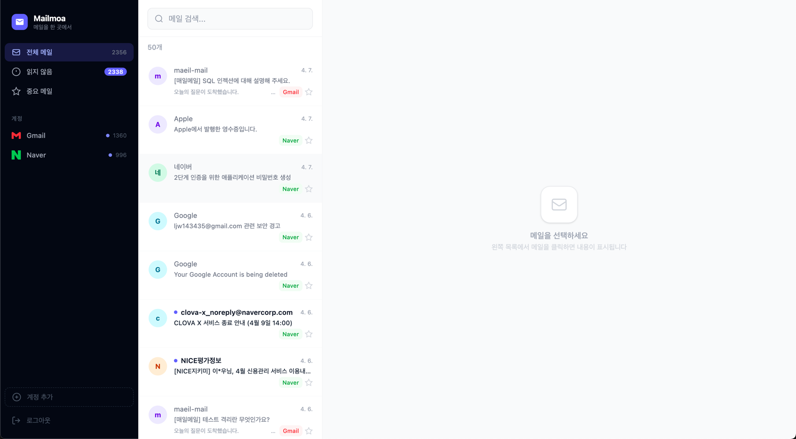

<div align="center">

# Mailmoa



여러 메일 계정을 **한 곳에서** 통합 관리하는 메일 클라이언트 서비스

</div>

---

## 프로젝트 소개

업무용 Gmail, 개인용 Naver 메일 계정을 동시에 사용합니다.
매번 탭을 바꿔가며 각 서비스에 접속하는 불편함을 해결하기 위해 Mailmoa를 만들었습니다.

Mailmoa는 Gmail, Naver 메일을 하나의 화면에서 확인하고 관리할 수 있는 통합 메일 클라이언트입니다.
계정을 연동하면 메일이 자동으로 동기화되고, 읽기·삭제·검색을 한 곳에서 처리할 수 있습니다.

- Gmail은 **Google OAuth2** 인증을 통해 안전하게 연동됩니다.
- Naver는 **IMAP** 프로토콜로 연동되며, 앱 비밀번호를 사용해 인증합니다.

---

### 요구 사항

- Java 17
- MySQL 8
- Redis 7

### 설치 및 실행

```bash
# 1. 레포지토리 클론
git clone https://github.com/your-username/mailmoa.git
cd mailmoa

# 2. Redis 실행 (Docker)
docker-compose up -d

# 3. MySQL DB 생성
# mysql -u root -p
# CREATE DATABASE mailmoa CHARACTER SET utf8mb4 COLLATE utf8mb4_unicode_ci;

# 4. 설정 파일 수정
# src/main/resources/application.yaml 에서 DB 정보, JWT 시크릿 등 입력

# 5. 서버 실행
./gradlew bootRun
```

서버는 `http://localhost:8080` 에서 실행됩니다.

---

## 기술 스택

**Environment**


**Development**


---

## API 주소

### 인증 `/api/auth`

| Method | URL | 설명 |
|--------|-----|------|
| POST | `/api/auth/signup` | 회원가입 |
| POST | `/api/auth/login` | 로그인 |
| POST | `/api/auth/refresh` | 토큰 갱신 |

### 메일 계정 `/api/mail-accounts`

| Method | URL | 설명 |
|--------|-----|------|
| POST | `/api/mail-accounts/naver` | Naver 계정 연동 |
| GET | `/oauth2/authorization/google?userId=` | Gmail OAuth2 연동 시작 |

### 메일 `/api/mails`

| Method | URL | 설명 |
|--------|-----|------|
| GET | `/api/mails` | 메일 목록 조회 (page, size) |
| GET | `/api/mails/count` | 메일 수 (전체 / 미읽음 / 계정별) |
| GET | `/api/mails/{id}` | 메일 상세 + 본문 |
| PATCH | `/api/mails/{id}/read` | 읽음 처리 |
| DELETE | `/api/mails/{id}` | 메일 삭제 |
| POST | `/api/mails/sync` | 수동 동기화 |
| POST | `/api/mails/load-older` | 이전 메일 추가 로드 |

---

## 주요 기능

### Gmail 연동
- Google OAuth2 인증 흐름으로 안전하게 연동
- Gmail Batch API 병렬 처리로 빠른 동기화 (배치 크기 100)
- `format=metadata` 경량 동기화 + 본문 클릭 시 lazy 로딩
- 429 Too Many Requests 자동 감지 및 재시도
- Access Token 만료 시 Refresh Token으로 자동 갱신

### Naver 연동
- IMAP SSL(imap.naver.com:993)으로 메일 동기화
- UID 기반 증분 동기화 (마지막 이후 신규 메일만 수집)
- 이전 메일 페이징 로드
- 메일 삭제 시 휴지통 이동 처리

